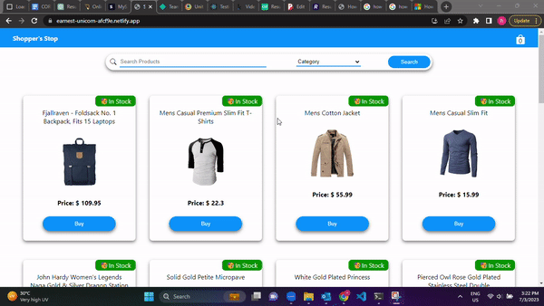

# React-Redux-Shopping-Website

> This is a React-Redux based E-commerse site.
> This project uses api from FakeApiStore to fetch data.

### ✨ [Live Demo](https://earnest-unicorn-afcf9e.netlify.app/)

## Install

```sh
npm install
```

## Usage

```sh
npm start
```

## Author

👤 **Rakshit Shinde**

* Github: [@rakshit-shinde](https://github.com/Rakshit4045)
* LinkedIn: [@rakshit-shinde](https://www.linkedin.com/in/rakshit-shinde-4744961a4/)
  
### Project Demo



## 🤝 Contributing

Contributions, issues and feature requests are welcome!<br />Feel free to check [issues page](https://github.com/Rakshit4045/React-Redux-Shopping-Website/issues). 

## Show your support

Give a ⭐️ if this project helped you!

## 📝 License

Copyright © 2023 [Rakshit](https://github.com/Rakshit4045).<br />
This project is [MIT](https://github.com/Rakshit4045/React-Redux-Shopping-Website/blob/main/LICENSE) licensed.
